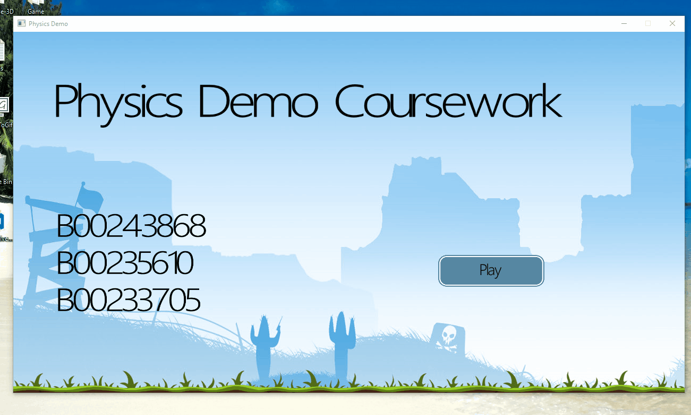
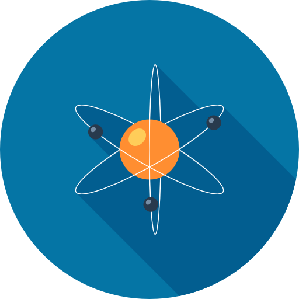

# Interactive Physical Modelling

The Interactive Physical Modelling module was about teaching basic physics to students which was assessed with an exam and a practical coursework. It was a chance for students to develop an understanding of how physics is simulated in both video games and wider computer software. While one of the more challenging modules it did provide a lot of opportunities to develop an interesting demo that proved students ability to take theoretical concepts and map them directly to software. 

## Assignment

The assignment was actually very simple. Make a physics demonstration in C++ with whatever technology you wanted. Providing you didn't use physics libraries as that would have been cheating. We were expected to work in teams with each members contribution made known through an individually submitted critical appraisal. The end playable demo should be the following.

* Replayable, with the option to vary parameters to show off effects
* Be written from scratch, no physics libraries allowed
* Show basic physics concepts such as gravity, velocity etc

## Submission

For our submission we wrote a simple projectile demonstration that aimed to simulate gravity, velocity, weight, mass and air resistance. It was written in C++ and OpenGL was used for the rendering. Once the basic physics functionality was built we then went on to build a UI to allow customization of the parameters to better show of the physics effects available in the demo. When launching the projectile the user can toggle the following settings.

* Air Resistance
* Material
* Angle
* Weight

## License

Apache 2.0